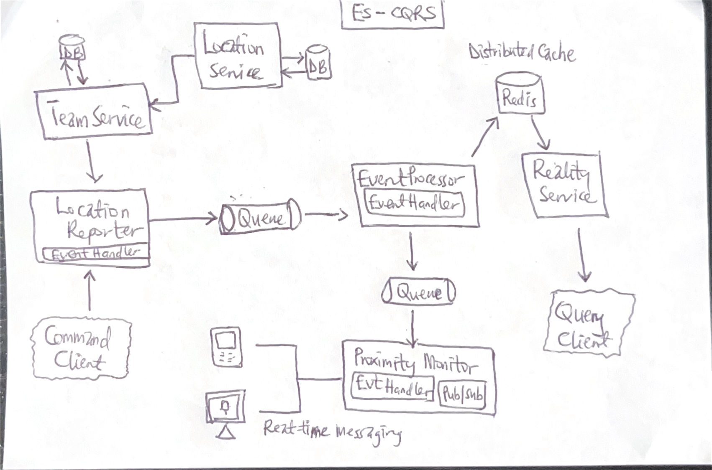

# SWC-Microservices-Suite

A cutting-edge suite of scalable, event-driven microservices for team management at fictional StatlerWaldorfCorp, enabling resilient inter-service communication and real-time data processing.

System utilizes the following core technologies:
- **RabbitMQ** as messaging queue, 
- **PubNub** for realtime messaging, 
- **Redis** as cache, and 
- **C# .NET** as core language

System High-level architecture:

The system contains 6 microservices components:

1. [Event Processor](https://github.com/pkErbynn/StatlerWaldorfCorp.ES-CQRS-EventProcessor)
2. [Proximity Monitor](https://github.com/pkErbynn/StatlerWaldorfCorp.ES-CQRS-ProximityMonitor)
3. [Location Reporter](https://github.com/pkErbynn/StatlerWaldorfCorp.ES-CQRS-LocationReporter)
4. [Reality Consumer](https://github.com/pkErbynn/StatlerWaldorfCorp.ES-CQRS-RealityConsumer)
5. [Location Service](https://github.com/pkErbynn/StatlerWaldorfCorp.LocationService)
6. [Team Service](https://github.com/pkErbynn/StatlerWaldorfCorp.TeamService)

---

### Event Processor
- **Repository:** [StatlerWaldorfCorp.ES-CQRS-EventProcessor](https://github.com/pkErbynn/StatlerWaldorfCorp.ES-CQRS-EventProcessor)
- **Description:** This microservice processes events and performs CQRS operations.

### Proximity Monitor
- **Repository:** [StatlerWaldorfCorp.ES-CQRS-ProximityMonitor](https://github.com/pkErbynn/StatlerWaldorfCorp.ES-CQRS-ProximityMonitor)
- **Description:** This microservice monitors the proximity of devices and triggers alerts.

### Location Reporter
- **Repository:** [StatlerWaldorfCorp.ES-CQRS-LocationReporter](https://github.com/pkErbynn/StatlerWaldorfCorp.ES-CQRS-LocationReporter)
- **Description:** This microservice reports the location of devices in real-time.

### Reality Consumer
- **Repository:** [StatlerWaldorfCorp.ES-CQRS-RealityConsumer](https://github.com/pkErbynn/StatlerWaldorfCorp.ES-CQRS-RealityConsumer)
- **Description:** This microservice consumes reality events and processes them for further use.

### Location Service
- **Repository:** [StatlerWaldorfCorp.LocationService](https://github.com/pkErbynn/StatlerWaldorfCorp.LocationService)
- **Description:** This microservice provides location-based services and APIs.

### Team Service
- **Repository:** [StatlerWaldorfCorp.TeamService](https://github.com/pkErbynn/StatlerWaldorfCorp.TeamService)
- **Description:** This microservice manages team-related operations and data.

